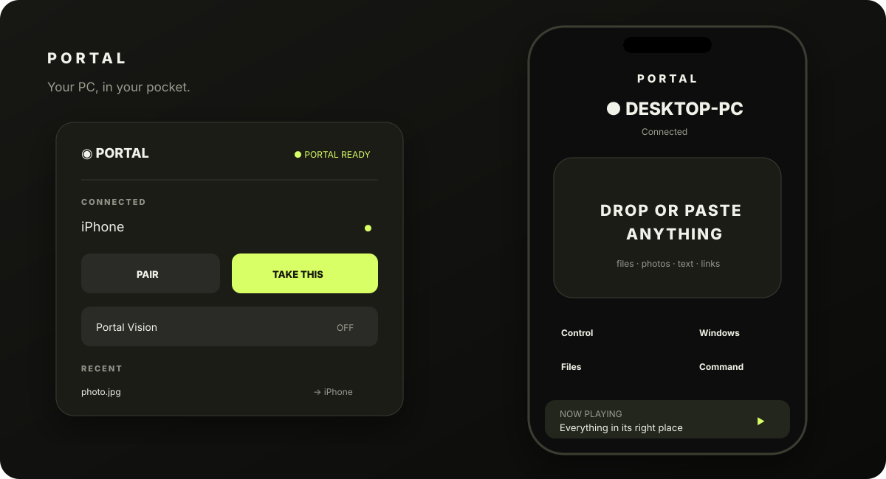

# Portal

> **Your PC, in your pocket.**

Portal is a secure, LAN-only phone-to-Omarchy control plane. It moves context, files, clipboard data, window intent and safe commands between a phone browser and an Omarchy desktop. It is deliberately not a remote-desktop stream: the phone understands windows, workspaces, media and actions directly.



Portal v0.9.1 is a **Local Acceptance Candidate** for Omarchy 4.0.2. It has no analytics, cloud account, relay or WAN mode.

## What it does

- **Universal Send:** drop a file/image or paste text/URL into one target. Portal recognizes it and places it in the temporary Portal Inbox.
- **Take This / Continue on PC:** transfer the reliable active desktop context to the phone, or open/copy a phone item on the PC.
- **Control:** touch trackpad, left/right click, scroll and typed keyboard input through unprivileged Wayland/Hyprland mechanisms.
- **Windows:** live Hyprland windows grouped by workspace, with focus, move, fullscreen and confirmed-close actions.
- **Portal Vision:** temporary session-bound QR markers appear over visible windows. Point the phone at one to open context-aware controls for exactly that live window.
- **Clipboard, media, audio, screenshots and command palette:** capability-gated and progressively disclosed.
- **Optional X-Ray:** detected at runtime; concise structured data appears only if `xray --json <target>` is available and valid.

## Architecture

The Omarchy plugin contains a native QML bar widget/panel and a long-lived service component. When the enabled service loads at login or after `omarchy restart shell`, it automatically starts and owns an unprivileged Python HTTPS process. A zero-framework PWA talks to that service with short-lived opaque sessions. SQLite stores hashes and metadata; transfer payloads are mode `0600` under `~/.local/state/portal/inbox`.

See [Architecture](docs/ARCHITECTURE.md), [Security](SECURITY.md), [Privacy](docs/PRIVACY.md), and [upstream compatibility](docs/UPSTREAM_COMPATIBILITY.md).

## Install

Requirements are already present on current Omarchy: Python 3.12+, OpenSSL, `qrencode`, Hyprland, Quickshell, `wl-clipboard`, `wtype`, `wpctl`, `grim`, `busctl`, and optionally `playerctl`.

```bash
omarchy plugin add https://github.com/3EYE3Y3/omarchy-portal.git --enable --yes
~/.config/omarchy/plugins/io.github.3eye3y3.portal/scripts/install-cli
~/.config/omarchy/plugins/io.github.3eye3y3.portal/scripts/install-keybinding
```

The stock `SUPER + SHIFT + P` binding launches Google Photos on Omarchy 4.0.2. Portal therefore installs the safe equivalent **`SUPER + CTRL + SHIFT + P`** for Take This. The script backs up `~/.config/hypr/bindings.lua`, refuses collisions, reloads Hyprland, and checks `hyprctl configerrors`.

## Pair a phone

1. Click the `◉` Portal bar indicator or run `portal`.
2. Scan the temporary QR code. The phone may ask you to accept Portal's local self-signed certificate; compare its SHA-256 fingerprint with `openssl x509 -in ~/.local/state/portal/tls.crt -noout -fingerprint -sha256` before accepting on an untrusted LAN.
3. Review the requested capability list on the PC and choose **Allow** or **Deny**.
4. The phone lands directly on Portal Home. Add it to the home screen if desired.

Pairing secrets expire after five minutes and are consumed by the first request. The secret is carried in the URL fragment, so it is not sent in HTTP request lines or access logs.

## Phone use

Portal Home stays intentionally small: one **DROP OR PASTE ANYTHING** target and four destinations—Control, Windows, Files, Command. Media appears as a compact bottom bar only when active. Audio outputs, transfer progress, monitor choices and X-Ray controls appear only when available.

### Universal Send and Portal Inbox

Tap the large target to choose files or images, drag into it on a tablet, or paste text/URLs below it. Phone-to-PC items land in `~/.local/state/portal/inbox`; nothing is executed or extracted. Names are Unicode-normalized, traversal is neutralized, unrelated files are never overwritten, and partial uploads remain temporary then disappear on failure.

Items expire after 24 hours by default. Explicit Secure Transfer items and text that heuristically resembles a secret expire after five minutes and never enter clipboard history. Secret detection is a convenience, not a guarantee—use the explicit checkbox for sensitive material.

### Take This and Continue on PC

Press `SUPER + CTRL + SHIFT + P` or run `portal take`. Portal reliably resolves terminal working directories and clipboard text/URLs, annotated with the active app. If application-specific state is not safely available, it says so through the fallback rather than inventing browser URLs or file selections.

From the phone, **Continue on PC** routes URLs to the default browser, files/images to the Inbox/open action, and text to the clipboard.

### Control

Grant `pointer` and `keyboard` to the device:

```bash
portal device permissions DEVICE_ID send_receive clipboard media window_control files command_palette pointer keyboard screenshots audio
```

The trackpad uses Hyprland 0.56's native Lua cursor dispatcher; keyboard input uses `wtype`. Click and scroll use Hyprland's synthetic shortcut dispatcher. No X11 or privileged input daemon is used.

### Windows and workspaces

Windows come from `hyprctl -j clients`; monitor/workspace changes use the typed `hl.dsp.*` Lua API installed with Hyprland 0.56. Close always requires phone confirmation. When there is one monitor, monitor selection stays hidden.

### Portal Vision

Open Portal Vision from the PC panel, phone Home, or Command. Passive QR markers are drawn above visible windows. Each marker contains a random, 20-second, single-use selector bound to one Portal session, one Hyprland address and its stable window identity. Scanning resolves current window state server-side, so a moved window remains valid while a destroyed/replaced one is rejected. Markers disappear as soon as Vision stops.

Chrome/Chromium Android supports the browser `BarcodeDetector` API. Browsers without it fall back to the equally live Windows list; camera-based marker scanning is therefore browser-dependent, while Vision selection remains available.

### Command, media, audio and screenshots

Command is a fixed action registry: lock, mute, launch terminal/browser, change workspace, screenshot and Vision. It does not expose arbitrary shell. MPRIS is accessed through `playerctl` when installed or direct user D-Bus through `busctl`; PipeWire/WirePlumber output switching uses `wpctl`. Screenshots use `grim` and return through the Inbox.

### X-Ray

Portal never requires X-Ray. If an executable named `xray` exists and returns a JSON object for `xray --json <window-address>`, the window detail may show concise telemetry. Missing, malformed or timed-out responses are silently treated as unavailable; Portal does not import or duplicate X-Ray internals.

## CLI

```text
portal                       open the native panel
portal status                service/device summary
portal pair                  create a temporary pairing QR
portal devices               list trusted devices
portal vision [on|off|toggle|status]
portal take                  Take This
portal send <file>           offer a PC file to the phone
portal doctor                capability report
```

Device administration uses `portal device disconnect|revoke|permissions DEVICE_ID ...`. Run `portal --help` for exact syntax.

## Doctor and development

```bash
portal doctor
./scripts/quality
```

The quality command runs 43+ domain/edge tests, Python bytecode/static safety checks, JS syntax validation, bash syntax, QML lint when installed, the authoritative Omarchy manifest validator, and `git diff --check`.

## Uninstall

```bash
~/.config/omarchy/plugins/io.github.3eye3y3.portal/scripts/uninstall-local
```

For safety the script retains `~/.local/state/portal`; inspect it, then remove it manually if you no longer need trusted-device metadata or Inbox items. Remove the clearly marked Portal lines from `~/.config/hypr/bindings.lua` if installed.

## Troubleshooting

- **Phone cannot connect:** confirm both devices are on the same local network, `portal status` shows the exact address, and client isolation is disabled on the Wi-Fi network.
- **Certificate warning:** local HTTPS uses a 30-day self-signed Ed25519 certificate. Verify the fingerprint on the PC before accepting it on the phone.
- **Camera does not scan:** use a Chromium-based phone browser with `BarcodeDetector`, or select the window from **Windows**.
- **Control says permission required:** grant `pointer` and `keyboard` explicitly with `portal device permissions`.
- **No media bar:** start an MPRIS-capable player; the bar is hidden when there is no player or metadata.
- **X-Ray hidden:** verify `xray --json <target>` returns a JSON object within two seconds.
- **Doctor reports service unavailable:** the plugin service starts when enabled, including after login and `omarchy restart shell`. Inspect `quickshell log` and ensure port `59443` is free.

Portal is not submitted to the Omarchy Marketplace. Human local acceptance comes first.
